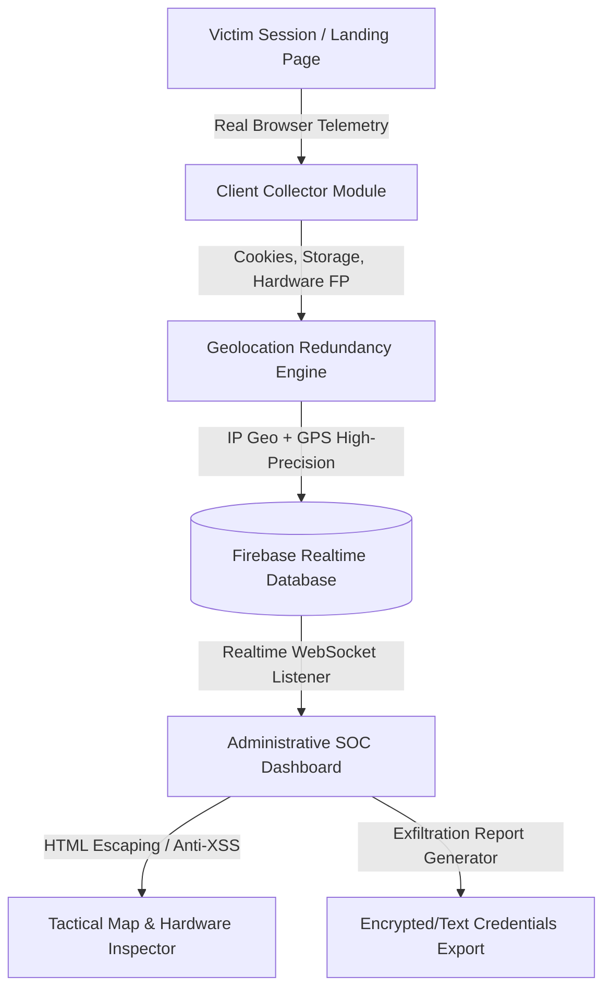

# 🛡️ TuAta — CyberForensic Telemetry & SOC Incident Response Platform

> **Red Team & Incident Response Laboratory**  
> Plataforma profesional de recolección de telemetría forense en tiempo real y panel de operaciones SOC para análisis de sesiones web y mitigación de amenazas.

---

## 📐 Arquitectura de la Solución

---

## 🔒 Matriz de Seguridad y Hardening

| Componente | Riesgo Identificado | Control Defensivo Aplicado | Estado |
| :--- | :--- | :--- | :--- |
| **Renderizado SOC** | Vulnerabilidad de Stored XSS por inyección en User-Agent/IP. | Función sanitizadora `escapeHTML()` en todas las salidas HTML dinámicas. | **Mitigado** |
| **Persistencia DB** | Riesgo de borrado/sobrescritura de registros por terceros. | Reglas de inmutabilidad en `database.rules.json` (`!data.exists()`). | **Mitigado** |
| **Acceso Dashboard** | Intentos de acceso no autorizado al panel de operaciones. | Overlay de autenticación con clave SOC y bloqueo visual. | **Implementado** |
| **Telemetría** | Datos simulados o estáticos. | Recolección directa de `document.cookie`, `localStorage` y `sessionStorage`. | **Implementado** |

---

## 🚀 Funcionalidades Clave

- **🗺️ Geolocalización Táctica**: Redundancia en cascada entre API IP Geolocation y GPS de alta precisión.
- **🖥️ Fingerprinting Avanzado**: Resolución de pantalla, WebGL Renderer, Cores de CPU, Batería, Estado AdBlock y recolección de almacenamiento.
- **📊 SOC Telemetry Dashboard**: Mapa interactivo con Leaflet.js, gráficos de S.O. con Chart.js y tabla de eventos en vivo.
- **📦 Exportación Forense**: Generación automática de reportes de credenciales y cookies por expediente (`.txt` y `.json`).

---

## 🛠️ Tecnologías Utilizadas

- **Frontend**: HTML5, Vanilla JavaScript (ES6+), CSS3.
- **Librerías Visuales**: Leaflet.js, Chart.js, Google Fonts (Inter, Fira Code).
- **Cloud & DB**: Firebase Realtime Database & Firebase Hosting.
- **DevOps**: Firebase CLI, Git.

---

## 🌐 Enlaces de Despliegue

- **Portal Web Forense**: [https://mi-lab-seguridad-8afd1.web.app](https://mi-lab-seguridad-8afd1.web.app)
- **Panel SOC Command**: [https://mi-lab-seguridad-8afd1.web.app/dashboard.html](https://mi-lab-seguridad-8afd1.web.app/dashboard.html)

---
*Desarrollado como proyecto de laboratorio y demostración técnica para portafolio profesional en ciberseguridad ofensiva y defensiva.*
